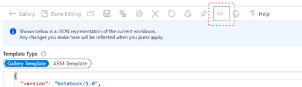

# Sentinel Incident Reporting

This solution contains a Workbook for reporting on Incidents in Microsoft Sentinel, as well as a Logic App that can be used to send a weekly report on the incident trends.

To use this workbook, create a new workbook in Microsoft Sentinel, and copy the code from this sample into the code area for the workbook, replacing the sample code in this workbook:

Use this button to deploy the Logic App to your environment

