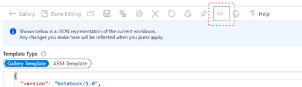

# Update Management

This solution contains a Workbook for visualising data from Azure Automation Update Management, as well as a Logic App that can be used to send a daily report on the latest updates available across machines managed by a single workspace/automation account.

To use any of the workbooks found here, create a new workbook in Azure Monitor, and copy the code from this sample into the code area for the workbook, replacing the sample code in this workbook:

Use this button to deploy the Logic App to your environment

